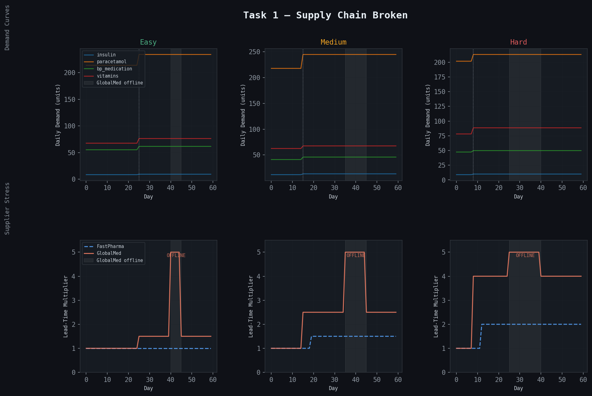
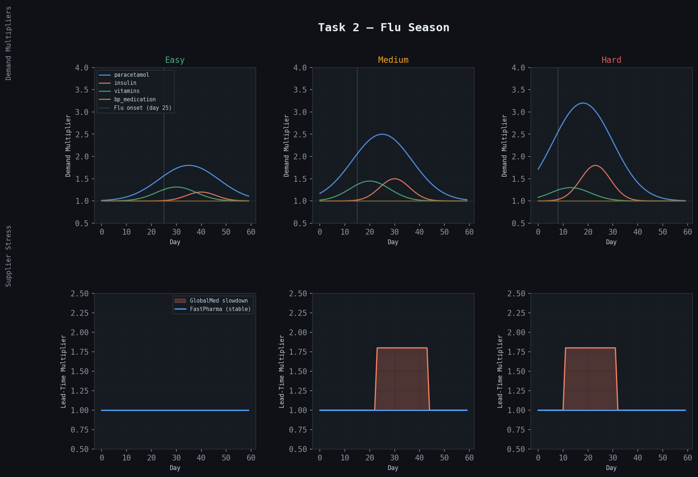
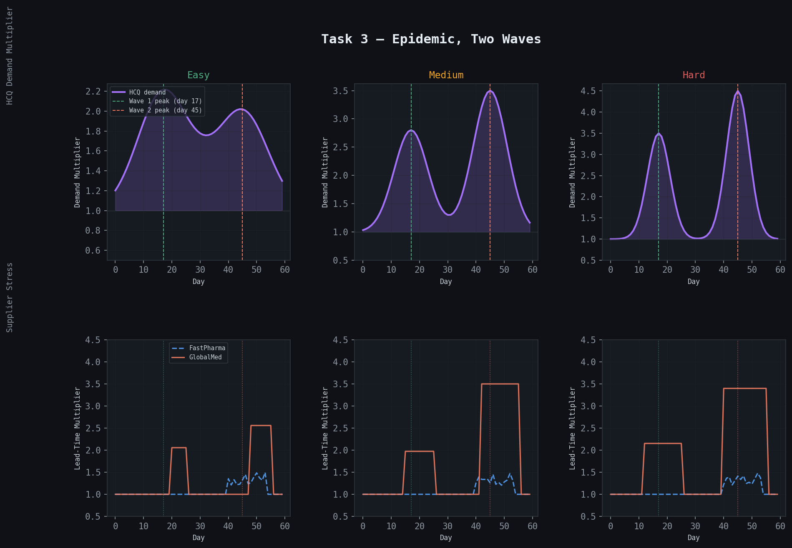

# Pharma Cold-Chain Inventory Management — OpenEnv Benchmark

An OpenEnv-compliant benchmark where an LLM agent manages a pharmaceutical warehouse over a 60-day episode. Every day the agent reads an inventory report and decides what to order, how much, and from which supplier. Demand is stochastic, lead times are uncertain, suppliers can disrupt, and a cold chain can fail. The agent must act under uncertainty with no visibility into the underlying processes driving the environment.

---

## The Problem

A warehouse stocks four drugs: insulin, BP medication, paracetamol, and vitamins. Every day the agent must decide:

- **What to order** — which SKUs need replenishment, and which can wait.
- **How much** — enough to cover demand without wasting budget on overstock.
- **From whom** — two suppliers with very different cost, speed, and reliability profiles.

The hard parts are:

- You cannot see today's true demand — only recent observed history.
- Lead times are stochastic and can extend without warning when a supplier disrupts.
- The procurement budget is shared across all four drugs — spending on vitamins today means less for insulin tomorrow.
- Insulin has no substitute and a 100-point stockout penalty. Vitamins are fully substitutable and carry a 5-point penalty. The agent must learn this hierarchy and act accordingly.
- A cold chain breach destroys all insulin on the shelf — triggering an emergency reorder with no guaranteed fast supply.

---

## Warehouse

### SKUs

| SKU | Drug | Storage | Penalty | Substitute |
|---|---|---|:---:|:---:|
| `insulin` | Insulin | Cold (2–8°C) | 100 | None |
| `bp_medication` | Amlodipine | Ambient | 60 | 40% |
| `paracetamol` | Paracetamol | Ambient | 20 | 60% |
| `vitamins` | Vitamins | Ambient | 5 | 100% |

### Suppliers

| Supplier | Cold Certified | SKUs | Lead Time | Cost | Expedite |
|---|:---:|---|:---:|:---:|:---:|
| `FastPharma` | ✓ | All four | ~2 days (σ = 0.5) | 1.4× | ✓ (2× cost) |
| `GlobalMed` | ✗ | Paracetamol, BP, Vitamins | ~7 days (σ = 2.5) | 1.0× | ✗ |

**Insulin can only be ordered from FastPharma.** GlobalMed is not cold-chain certified — orders to it for insulin are rejected.

---

## Action Format

Each day the agent responds with a JSON object:

```json
{
  "insulin":     [100, "FastPharma"],
  "paracetamol": [500, "GlobalMed"]
}
```

Only include SKUs you want to order. Omit to skip. Send `{}` to place no orders.

Orders are rejected if:
- The supplier does not serve that SKU.
- The supplier is disrupted or offline.
- Budget or storage capacity would be exceeded.
- A non-certified supplier is given an insulin order.

---

## Tasks

Three scenario types, three difficulty levels each. All episodes run 60 days.

### Task 1 — Supply Chain Broken

Supply-side stress only. Lead times extend from a certain day. GlobalMed goes fully offline for a window. Demand is nearly flat — the challenge is building enough safety stock before the disruption hits, not reacting to demand spikes.

| Difficulty | Stress Starts | GlobalMed Offline | Starting Cover |
|---|:---:|:---:|:---:|
| Easy | Day 25 | 5 days @ day 40 | 14 days |
| Medium | Day 15 | 10 days @ day 35 | 7 days |
| Hard | Day 8 | 15 days @ day 25 | 4 days |



### Task 2 — Flu Season

Demand surge. Paracetamol spikes sharply during the flu peak. Insulin follows when flu hits diabetic patients. GlobalMed slows as logistics workers fall ill. The epidemic alert fires a few days before the peak — the agent must pre-stock in that window, not wait for the stockout.

| Difficulty | Flu Onset | Paracetamol Peak | Supply Stress |
|---|:---:|:---:|:---|
| Easy | Day 25 | Day 35 | None |
| Medium | Day 15 | Day 25 | GlobalMed 1.8× from day 23 |
| Hard | Day 8 | Day 18 | GlobalMed 1.8× from day 11 |



### Task 3 — Epidemic, Two Waves

Two-wave epidemic with a new SKU: Hydroxychloroquine (HCQ). Wave 1 peaks at day 17, wave 2 at day 45 and is larger. The trough between waves is a trap — the agent must keep ordering through it. Lead time stress hits before the wave 2 peak at hard difficulty, meaning orders placed reactively arrive too late.

| Difficulty | Wave 1 Amplitude | Wave 2 Amplitude | Lead Stress |
|---|:---:|:---:|:---|
| Easy | 1.2× | 1.0× (smaller) | After peak |
| Medium | 1.8× | 2.5× | At peak |
| Hard | 2.5× | 3.5× | Before peak |



---

## Scoring

### Per-Step Reward

```
reward = 0.50 × fill_rate_7d
       + 0.30 × critical_sku_fill_rate   (insulin + BP med only)
       + 0.10 × (1 - overstock_pressure)
       + 0.10 × procurement_budget_ratio
```

Clamped to [0.01, 0.99].

### Final Episode Score

```
final_score = 0.50 × mean(step_rewards)
            + 0.30 × prescription_fill_rate_30d
            + 0.20 × (1 - total_backorder_ratio)
```

**Success threshold: 0.80.** An agent that fills prescriptions but drains the budget scores ~0.60. An agent that protects the budget but lets insulin stock out scores ~0.50. Consistently scoring above 0.80 requires managing both.

---

## Baselines

| Model | Supply Chain (E/M/H) | Flu Season (E/M/H) | Epidemic (E/M/H) | Success Rate |
|---|:---:|:---:|:---:|:---:|
| *Results to be published post-evaluation* | — | — | — | — |

---

## Setup

```bash
# Install dependencies
uv sync

# Configure environment variables
cp .env.example .env
# Set HF_TOKEN, MODEL_NAME, API_BASE_URL

# Start the server
uv run server

# Run the benchmark
python inference.py
```

### Environment Variables

| Variable | Default | Description |
|---|---|---|
| `API_BASE_URL` | `https://router.huggingface.co/v1` | LLM API endpoint |
| `MODEL_NAME` | `Qwen/Qwen2.5-72B-Instruct` | Model identifier |
| `HF_TOKEN` | — | HuggingFace API key |
<<<<<<< HEAD
| `LOCAL_IMAGE_NAME` | — | Docker image name (optional) |
| `ENV_BASE_URL` | `http://localhost:8000` | Server URL when not using Docker |
=======
| `ENV_BASE_URL` | `http://localhost:8000` | Server URL |
>>>>>>> 25b3278ac453e5c3b183d6568c8e3772e696d929

---

## Project Structure

```
pharma_env/
├── environment.py   # Simulation: demand sampling, inventory updates,
│                    # arrivals, disruptions, cold chain breach, LLM prompt
├── models.py        # Pydantic schemas: SKUState, SupplierState,
│                    # InventoryState, PharmaAction
├── tasks.py         # Task constructors + reward functions
├── inference.py     # Benchmark execution
├── client.py        # OpenEnv async client
└── openenv.yaml     # Environment manifest
```